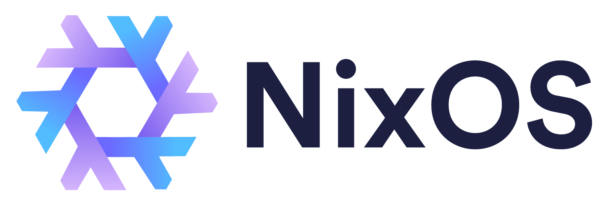

# slothful nix-darwin



[](https://github.com/nix-darwin/nix-darwin)
[](https://nix-community.github.io/home-manager/)
[](https://nix.dev/manual/nix/latest/command-ref/new-cli/nix3-flake)

## Snapshot

| Area | Current setup |
| --- | --- |
| Host | `Slothbook` |
| User | `slothy` |
| Platform | `aarch64-darwin` |
| Nixpkgs | `nixpkgs-unstable` |
| System layer | `nix-darwin` |
| Homebrew layer | `nix-homebrew` |
| User layer | Home Manager via `home.nix` |

## What This Manages

- System packages for shell work, networking, JavaScript/mobile tooling,
  version control, editors, and creative tools.
- System services for Tailscale.
- Homebrew casks for desktop apps like Docker Desktop, Helium, 1Password,
  Obsidian, Raycast, Discord, Spotify, Steam, Ghostty, Zed, Visual Studio Code,
  Claude, Claude Code, Codex, Codex App, and Wispr Flow.
- macOS defaults for dark mode, Dock contents, Dock autohide/magnification,
  Raycast hotkeys, Spotlight keybinding cleanup, and Caps Lock to Escape.
- Home Manager settings for Git, Zsh, Oh My Zsh, Ghostty config, `fzf`,
  `direnv`, `nix-direnv`, `zoxide`, and Codex Vim mode.
- A weekly launchd cleanup job that keeps the last 5 Nix generations and runs
  store garbage collection.

## Layout

```text
.
+-- flake.nix      # nix-darwin system, packages, services, Homebrew, macOS defaults
+-- home.nix       # Home Manager user config
+-- flake.lock     # pinned flake inputs
+-- assets/
|   +-- nixos.png  # local README banner
+-- README.md
```

## Daily Commands

Apply the system:

```sh
sudo darwin-rebuild switch --flake .#Slothbook
```

Or use the Home Manager Zsh alias from this repo root:

```sh
drs
```

Build without switching:

```sh
darwin-rebuild build --flake .#Slothbook
```

Update inputs:

```sh
nix flake update
```

Format Nix files:

```sh
nix fmt
```

## Package Buckets

| Bucket | Examples |
| --- | --- |
| Shell | `bat`, `eza`, `fd`, `fastfetch`, `fzf`, `ripgrep`, `tldr`, `television`, `tree`, `uv`, `zoxide` |
| Git | `git`, `gh` |
| Networking | `tailscale` |
| Editors | `neovim` |
| JS/mobile | `bun`, `cocoapods`, `fnm`, `flutter`, `nodejs`, `pnpm`, `rustup`, `xcodegen` |
| Creative | `blender` |
| Apps | `docker-desktop`, `helium-browser`, `1password`, `obsidian`, `raycast`, `discord`, `spotify`, `steam`, `ghostty`, `zed`, `visual-studio-code`, `claude`, `claude-code`, `codex`, `codex-app`, `wispr-flow` |

## Services

| Service | Status |
| --- | --- |
| Tailscale | Enabled at startup |

## Notes

- `flake.nix` is the source of truth for system packages, Homebrew apps, fonts,
  macOS defaults, keyboard mapping, and nix-darwin modules.
- `home.nix` is the source of truth for user-level shell/editor behavior.
- Homebrew cleanup is set to `zap`, so removed casks are cleaned aggressively on
  activation.
- 1Password is configured to allow Helium through
  `/etc/1password/custom_allowed_browsers`.
- The Dock is intentionally short: Helium, Ghostty, Claude, and Codex.

## References

- [nix-darwin](https://github.com/nix-darwin/nix-darwin)
- [Nix flakes manual](https://nix.dev/manual/nix/latest/command-ref/new-cli/nix3-flake)
- [Home Manager manual](https://nix-community.github.io/home-manager/)
