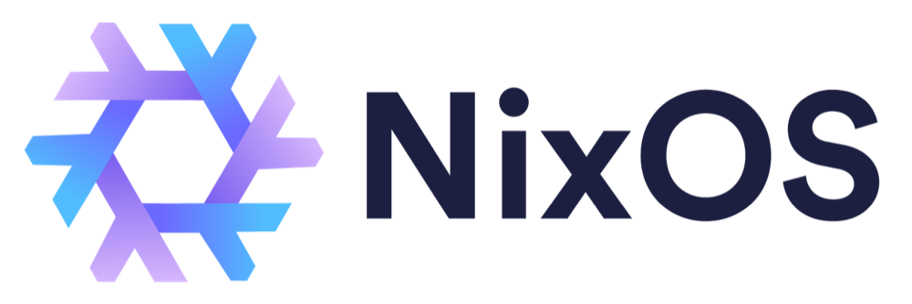

# slothful nix-darwin



[](https://github.com/nix-darwin/nix-darwin)
[](https://nix-community.github.io/home-manager/)
[](https://nix.dev/manual/nix/latest/command-ref/new-cli/nix3-flake)

## Snapshot

| Area | Current setup |
| --- | --- |
| Configs | `slothbook`, `slouch`, `work` (see [Hosts](#hosts)) |
| User | `slothy` |
| Platform | `aarch64-darwin` |
| Nixpkgs | `nixpkgs-unstable` |
| System layer | `nix-darwin` |
| Homebrew layer | `nix-homebrew` |
| User layer | Home Manager via `home.nix` |

## Hosts

One nix-darwin configuration per Mac. All of them expect the `slothy` user on
Apple Silicon.

| Host | Machine | On top of the shared base |
| --- | --- | --- |
| `slothbook` | Personal laptop | Personal tooling, desktop apps, AeroSpace, Discord, Steam, Roblox, Roblox Studio |
| `slouch` | Mac Studio used as a cloud computer | Personal tooling, Roblox Studio, Blender, Claude |
| `work` | Work Mac | Desktop apps, AeroSpace, work git identity |

- **Shared base** (`modules/darwin.nix`, every Mac): the CLI tools under
  [Packages](#packages), Docker Desktop, Helium, 1Password, Obsidian, Raycast,
  Slack, Ghostty, ChatGPT, OpenLogi, the Claude Code / Codex / Cursor / pi
  CLIs, SSH (Remote Login), macOS defaults and the Home Manager config.
- **Personal tooling** (`modules/personal.nix`): Tailscale, and the Roblox
  dev tooling: `selene`, `~/.rokit/bin` on the `PATH`, the ElevenLabs CLI.
- **Desktop apps** (`modules/desktop.nix`, the Macs you sit at): Google
  Chrome, Thaw, Spotify, Zed, Visual Studio Code, Claude, Wispr Flow.
- **AeroSpace** (`modules/aerospace.nix`): the tiling window manager, the
  launchd agent that starts it and its config.

## Fresh Mac Setup

### 1. Install Nix

Use the [official installer](https://nixos.org/download/) (multi-user, the
only supported mode on macOS):

```sh
curl --proto '=https' --tlsv1.2 -L https://nixos.org/nix/install | sh
```

Then open a new shell so `nix` is on your `PATH`.

> Don't use the Determinate installer: it now installs Determinate Nix, which
> requires `nix.enable = false` in nix-darwin and conflicts with the `nix.*`
> settings this flake manages.

### 2. Apply this flake (one command)

Pick the host from the table above and run, straight from GitHub (no clone
needed):

```sh
sudo nix run --extra-experimental-features "nix-command flakes" nix-darwin/master#darwin-rebuild -- switch --flake github:SlothfulDreams/nix-darwin-config#<host>
```

For example `#slouch` on the Mac Studio. This builds whatever is pushed to
GitHub, so push local changes first. The `--extra-experimental-features` flag
is only needed this first time; the flake enables flakes permanently from
then on.

This installs nix-darwin, Homebrew (via nix-homebrew), all packages, casks,
macOS defaults, and the Home Manager user config in a single pass.

> Homebrew cleanup is `zap`: every switch uninstalls any Homebrew app the host
> doesn't list, including ones installed by hand, and deletes their data. Check
> the host's list before the first switch, especially on the work Mac.

> Note: Nix itself doesn't need Xcode Command Line Tools, but Homebrew may
> prompt for them (`xcode-select --install`) if a tap formula has to build
> from source.

### 3. Clone for local edits

```sh
git clone https://github.com/SlothfulDreams/nix-darwin-config.git ~/.config/nix
```

After the first activation, `darwin-rebuild` is on your `PATH` and the `drs` /
`nup` shell helpers are available, so future rebuilds are just `drs` from
`~/.config/nix`. Both rebuild the host they were built from.

### 4. Per-host follow-up

- `slothbook`, `slouch`: log in to Tailscale with `sudo tailscale up`.
- `work`: replace the placeholder git name and email in `hosts/work.nix`,
  then `drs`.
- Every Mac: add API keys with `secrets` (see [Secrets](#secrets)).

### Moving a Mac off the old `default` config

Configs used to be a single `.#default`. Its `drs` / `nup` still point there,
so switch once by hand:

```sh
cd ~/.config/nix && git pull && sudo darwin-rebuild switch --flake .#<host>
```

From then on `drs` and `nup` target that host.

## What This Manages

- System packages for shell work, version control, media, editors, and
  JavaScript/mobile tooling.
- SSH (Remote Login) on every Mac; Tailscale on the personal ones.
- Homebrew casks for desktop apps, per host (see [Hosts](#hosts)).
- macOS defaults for dark mode, Dock contents, Dock autohide/magnification,
  Raycast hotkeys, Spotlight keybinding cleanup, and Caps Lock to Escape.
- Home Manager settings for Git, Zsh, Oh My Zsh, Ghostty config, AeroSpace
  (via `programs.aerospace.settings`), `fzf`, `direnv`, `nix-direnv`,
  `zoxide`, and Codex Vim mode.
- A weekly launchd cleanup job that keeps the last 5 Nix generations and runs
  store garbage collection.

## Layout

```text
.
+-- flake.nix          # inputs and one darwinConfiguration per host
+-- modules/
|   +-- darwin.nix     # shared base: packages, services, Homebrew, macOS defaults
|   +-- personal.nix   # personal Macs: Tailscale, Roblox dev tooling
|   +-- desktop.nix    # apps for the Macs you sit at
|   +-- aerospace.nix  # AeroSpace cask, launchd agent and config
+-- hosts/
|   +-- slothbook.nix  # personal + desktop + AeroSpace + Discord, games
|   +-- slouch.nix     # personal + Roblox Studio, Blender, Claude
|   +-- work.nix       # desktop + AeroSpace + work git identity
+-- home.nix           # Home Manager user config (shared by every host)
+-- aerospace/
|   +-- center-panel.sh  # helper referenced by the AeroSpace config
+-- flake.lock         # pinned flake inputs
+-- assets/
|   +-- nixos.png      # local README banner
+-- README.md
```

## Daily Commands

Apply the system:

```sh
sudo darwin-rebuild switch --flake .#<host>
```

Or use the Home Manager Zsh function from this repo root. It keeps sudo
authorization active for the full rebuild, including Homebrew operations, and
rebuilds this Mac's host:

```sh
drs
```

Build without switching:

```sh
darwin-rebuild build --flake .#<host>
```

Update all inputs and rebuild this Mac's host in one go:

```sh
nup
```

Update inputs:

```sh
nix flake update
```

Format Nix files:

```sh
nix fmt
```

## Adding or Changing a Host

- To add a host, create `hosts/<name>.nix`, add the name to the list in
  `flake.nix`, and `git add` the new file (flakes only see tracked files).
- To give only some Macs a package or app, put it in a host file or a module
  they import, not in `modules/darwin.nix`. Nix lists merge, so a host can add
  to the shared lists but not remove from them.

## Secrets

Shell secrets such as API keys live in `~/.config/zsh/secrets.env`, one
`KEY=value` per line. The file is local to each Mac, lives outside this repo,
and is readable only by you. Every new zsh exports its values, like `export`
lines in `.zshrc`.

Add or change a secret (creates the file on first use):

```sh
secrets
```

This opens the file in `$EDITOR` and exports the values into the current shell
when you quit. Other open shells pick them up when restarted.

## Packages

System packages on every Mac:

| Bucket | Packages |
| --- | --- |
| Shell | `bat`, `eza`, `fd`, `fastfetch`, `fzf`, `ripgrep`, `tldr`, `television`, `tree`, `uv`, `zoxide` |
| Git | `git`, `gh` |
| Media | `ffmpeg`, `yt-dlp` |
| Editors | `neovim` |
| JS/mobile | `bun`, `cocoapods`, `fnm`, `nodejs`, `pnpm`, `rustup`, `xcodegen` |
| Homebrew CLIs | `herdr`, `mole`, `pi-coding-agent`, `greptile`, `claude-code@latest`, `codex`, `cursor-cli` |

Per-host packages and apps are listed under [Hosts](#hosts).

## Services

| Service | Hosts |
| --- | --- |
| SSH (Remote Login) | all |
| Tailscale | `slothbook`, `slouch` |
| AeroSpace (launchd agent) | `slothbook`, `work` |

## Notes

- `modules/darwin.nix` is the source of truth for the shared base;
  `hosts/` and the other `modules/` add to it per host.
- `home.nix` is the source of truth for user-level shell/editor behavior.
- Homebrew cleanup is set to `zap`, so removed casks are cleaned aggressively on
  activation.
- 1Password is configured to allow Helium through
  `/etc/1password/custom_allowed_browsers`.
- The Dock is intentionally short: Helium, Ghostty, Claude, and ChatGPT.

## References

- [nix-darwin](https://github.com/nix-darwin/nix-darwin)
- [Nix flakes manual](https://nix.dev/manual/nix/latest/command-ref/new-cli/nix3-flake)
- [Home Manager manual](https://nix-community.github.io/home-manager/)
